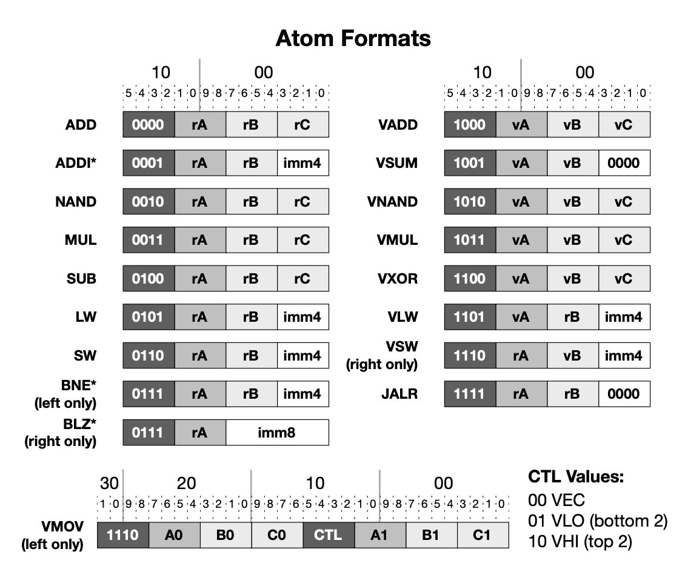

<h1 style="text-align:center;">RISC-32 ISA based CPU on FPGAs using Verilog</h1>
The three main objectives of this project are:
- To learn Verilog.
- Gain knowledge of the RISC-32 Instruction Set Architecture to facilitate the development of a softcore CPU on FPGAs for machine code execution.
- Comprehend parallelism concepts such as carrying out multiple instances of the same operation in parallel on various data sets.

<h2 style="text-align:center;">1. RISC-32 Instruction Set</h2>

The RiSC-32 is a 32-bit VLIW (very long instruction word) design which encapsulates two atomic instructions into a single instruction word, so that the hardware can execute multiple things at once.
### 1.1. Very Long Instruction Word (VLIW)
#### 1.1.1. What is it?
Very Long Instruction Word (VLIW) architecture employs instructions that encode multiple operations within a single word.

Each instruction in a VLIW architecture typically consists of fixed-size fields, with each field dedicated to a specific operation or functional unit.

The VLIW instruction format allows for parallel execution of operations, enabling high performance in superscalar processors.

#### 1.1.2. Why use it? Pros & Cons
The key to higher performance in microprocessors for a broad range of applications is the ability to exploit fine-grain, instruction-level parallelism. Some methods for exploiting fine-grain parallelism include:
+ Pipelining
+ Multipleprocessors
+ Superscalarimplementation
+ Specifying multiple independent operations per instruction

Advantages :
+ Reduces hardware complexity.
+ Reduces power consumption because of reduction of hardware complexity.
+ Since compiler takes care of data dependency check, decoding, instruction issues, it becomes a lot simpler.
+ Increases potential clock rate.
Functional units are positioned corresponding to the instruction pocket by compiler.

Disadvantages :
+ Complex compilers are required which are hard to design.
Increased program code size.
+ Larger memory bandwidth and register-file bandwidth.
+ Unscheduled events, for example a cache miss could lead to a stall which will stall the entire processor.
+ In case of un-filled opcodes in a VLIW, there is waste of memory space and instruction bandwidth.

#### 1.1.3. Architecture comparison: CISC, RISC, and VLIW
The differences between RISC, CISC, and VLIW are in the formats and semantics of the instructions:


The number of CISC instructions varies, they frequently define an order of operations, and they may call for serial (slow) decoding techniques. A common feature of CISCs is their small number of registers, some of which may be special-purpose registers with limited uses. Usually, memory references are used in conjunction with other actions (add memory to register, for example). The purpose of CISC instruction sets is to leverage microcode.

RISC instructions are straightforward (fast) to decode, describe simple actions, and have a fixed size. There are a lot of general-purpose registers in RISC architectures. Only basic load-register-from-memory and store-register-to-memory operations allow instructions to access main memory. RISC instruction sets are made to make pipelining easier and do not require microcode.

VLIW instructions are lengthier than RISC instructions in order to indicate numerous independent simple operations. You can think of a VLIW instruction as multiple RISC instructions combined into one. Most characteristics of VLIW designs are RISC-like.

### 1.2. RISC-32 VLIW ISA
#### 1.2.1. VLIW Instruction Format
Both the data and the instructions have a length of 32 bits. Every 32-bit instruction is split into two atoms. An atom can operate on one of the two register files—the 16-entry vector register file on the right or the 16-entry scalar register file on the right—based on its opcode. 

Furthermore, an atom may function on both register files in specific situations. Each of the 16 registers in the scalar register file has a width of 32 bits. There are 16 registers in the vector register file as well, however they are all 128 bits wide, or one vector made up of four 32-bit words.


#### 1.2.2. Conventions and Terminology
- XLEN: bit-length of register in the machine architecture. EX: 32, 64, 128.
- sxN(val): sign extend val to the left by repearting the sign bit to get a N bits data. EX: sx16(0x8a) --> 0xff8a
- zxN(val): zero extend val to the left by repearting 0 to get a N bits data. EX: zx16(0x8a) --> 0x008a
- zrN(val): zero extend val to the right by repeating 0 to get a N bits data. EX: zr(0x8a) --> 0x8a00
- mN(addr): N bits data (little-endian) in memory starting at address addr. EX: m8(addr) <- source, dest <- m16(addr)
- pc: current value of program counter.
- rX: register X
- immN: N bits immediate numberic operand, the data stored within instruction.
- rX[h:l]: h to l bit of register X. EX: rA[15:3]

#### 1.2.3. Opcodes
Opcodes, which are 4-bit values, have sixteen various operations that they can encode. Furthermore, the meaning of some opcodes varies based on whether they appear on the right side (atom 1, the low-order bits) or the left side (atom 0, the high-order bits) of the instruction.

A read or write to the vector register file is indicated by the use of a "vX" register identifier in each case, while a read or write to the scalar register file is indicated by the use of a "rX" register identifier.



More details are in the table below:
Scalar Operations: 0xxx and include 1111
Vector Operations: 1xxx not include 1111
<table>
    <thead>
        <th>Opcode</th>
        <th>Assembly</th>
        <th>Action</th>
        <th>Description</th>
    </thead>
    <tbody>
        <tr>
            <td>0000</td>
            <td>add rA, rB, rC</td>
            <td>rA <= rB + rC</td>
            <td>Add stored data in register B with stored data register C then store result data in register A.</td>
        </tr>
        <tr>
            <td>0001</td>
            <td>addi rA, rB, imm</td>
            <td>rA <= rB + sx32(imm4)</td>
            <td>Add stored data in register B with immediate data then store result data in register A.</td>
        </tr>
        <tr>
            <td>0010</td>
            <td>nand rA, rB, rC</td>
            <td>rA <= rB nand rC</td>
            <td>Nand stored data in register B with stored data in register C then store result data in register A.</td>
        </tr>
        <tr>
            <td>0011</td>
            <td>mul rA, rB, rC</td>
            <td>rA <= rB * rC</td>
            <td>Multiple stored data in register B with stored data in register C then store result data in register A.</td>
        </tr>
        <tr>
            <td>0100</td>
            <td>sub rA, rB, rC</td>
            <td>rA <= rB - rC</td>
            <td>Subtract stored data in register B with stored data in register C then store result data in register A.</td>
        </tr>
        <tr>
            <td>0101</td>
            <td>lw rA, rB, imm</td>
            <td>rA <= m32[rB + sz32(imm4)]</td>
            <td>Load 32 bits data from memory into register A. Memory address is formed by adding stored data in register B with immediate data.</td>
        </tr>
        <tr>
            <td>0110</td>
            <td>sw rA, rB, imm</td>
            <td>rA => m32[rB + sz32(imm4)]</td>
            <td>Store 32 bits data from register A into memory. Memory address is formed by adding stored data in register B with immediate data.</td>
        </tr>
        <tr>
            <td>0111</td>
            <td>bne rA, rB, imm (atom left only)</td>
            <td>PC <= (rA != rB) ? (PC + sz32(imm4)) : (PC + 1)</td>
            <td>If the stored data in register A and stored data in register B are not the same, branch to the address PC + imm, where PC is the address of this bne instruction.</td>
        </tr>
        <tr>
            <td>0111</td>
            <td>blz rA, imm (atom right only)</td>
            <td>PC <= (rA < 0) ? (PC + sz32(imm8)) : (PC + 1)</td>
            <td>If the stored data in register A is less than zero, branch to the address PC + imm, where PC is the address of this blz instruction.</td>
        </tr>
        <tr>
            <td>1000</td>
            <td>vadd vA, vB, vC</td>
            <td>vA <= vB + vC.i</td>
            <td>Add contents of vector B with vector C, then store result in vector A.</td>
        </tr>
        <tr>
            <td>1001</td>
            <td>vsum rA1, vB (atom right only)</td>
            <td>rA1 <= sum(vB.i with i in 0 to 3)</td>
            <td>Sum all 4 32-bit data values in vector B, then store results in scalar register A1.</td>
        </tr>
        <tr>
            <td>1010</td>
            <td>vnand vA, vB, vC</td>
            <td>vA <= vB nand vC.i</td>
            <td>Nand contents of vector B with vector C, then store result in vector A.</td>
        </tr>
        <tr>
            <td>1011</td>
            <td>vmul vA, vB, vC</td>
            <td>vA <= vB * vC</td>
            <td>Multiply contents of vector B with vector C, then store result in vector A.</td>
        </tr>
        <tr>
            <td>1100</td>
            <td>vxor vA, vB, vC</td>
            <td>vA <= vB xor vC</td>
            <td>Xor contents of vector B with vector C, then store result in vector A.</td>
        </tr>
        <tr>
            <td>1101</td>
            <td>vlw vA, rB, imm</td>
            <td>vA <= m128[vB + sz32(imm4)]</td>
            <td>Load 128-bit data from memory into vector A. Memory address is formed by adding stored data in register B with immediate data.</td>
        </tr>
        <tr>
            <td>1101</td>
            <td>vsw vA, rB, imm (atom rigth only)</td>
            <td>vA => m128[vB + sz32(imm4)]</td>
            <td>Store 128-bit data from vector A into memory. Memory address is formed by adding stored data in register B with immediate data.</td>
        </tr>
        <tr>
            <td>1110</td>
            <td>vec vA, rB0, rC0, rB1, rC1 (atom left only)</td>
            <td>vA.0 <= rB0, vA.1 <= rC0, rA.2 <= rB1, rA.3 <= rC1</td>
            <td>Read 4 32-bit data values from scalar register file (rB0, rC0, rB1, rC1), write into the vector register file at register vector A.</td>
        </tr>
        <tr>
            <td>1110</td>
            <td>vlo rA0, rA1, vB (atom left only)</td>
            <td>rA0 <= vB.0, rA1 <= vB.1</td>
            <td>Read 2 32-bit data values from low scalars in vector B, write into A0, A1 scalar registers.</td>
        </tr>
        <tr>
            <td>1110</td>
            <td>vhi rA0, rA1, vB (atom left only)</td>
            <td>rA0 <= vB.2, rA1 <= vB.3</td>
            <td>Read 2 32-bit data values from high scalars in vector B, write into A0, A1 scalar registers.</td>
        </tr>
        <tr>
            <td>1111</td>
            <td>jalr rA, rB</td>
            <td>PC <= rB, rA <= PC + 1</td>
            <td>Branch to the address in register B. Store PC + 1 into register A, where PC is the address of this jalr instruction.</td>
        </tr>
    </tbody>
</table>

<h2 style="text-align:center;">2. RISC-32 Memory</h2>

### 2.1. Word Addressing & Memory Access
All scalar addresses in the RiSC-32 architecture are word-based (i.e., memory address 0 corresponds to the first 32 bits, or four bytes, of main memory, address 1 corresponds to the second four bytes of main memory, etc.). The machine can perform two scalar memory operations per cycle.

All vector offsets (immediate values for VLW and VSW instructions) in the RiSC-32 architecture are also word-based and operate on a much larger word (i.e., address offset of 1 corresponds to 4 bytes beyond the address, address offset of 2 corresponds to 8 bytes beyond the address, etc.). The machine can perform two vector loads but only one vector store per cycle, and the VSW instruction is only valid on the right side (even though you might want to, you cannot perform two VSW operations simultaneously, but you can perform two VLW operations).
### 2.2. Large Immediate Values
The architecture’s 4-bit immediate values can represent numbers in the range [-8 .. 7]. Because this is relatively limited, the instruction set allows for larger values for ADDI/VADDI and BRANCH instructions (but not LW/SW instructions). If an immediate for an ADDI/VADDI or BRANCH instruction is desired that is outside the specified range, it is specified by placing a 0 value in the instruction’s immediate field. The 0 value is chosen because, for example, an ADDI instruction wishing to add a zero value to a register could simply have used the ADD instruction and referenced register 0, which is always zero. When a 0 value is in the ADDI’s immediate field, the following 32-bit value is not an instruction but a full 32-bit immediate value. This is signaled to the assembler by putting a “.l” (dot el) at the end of an ADDI or BNE or BLZ instruction.

``` assembly
addi r1, r2, 7      |   nand r4, r5, r6
add  r7, r8, r9     |   vxor v10, v11, v12

1120 2456
00c0 ffee
0789 cabc
```
<h2 style="text-align:center;">3. Verilog Implementation</h2>

The heart of the project is to create in Verilog a CPU model of the RiSC-32 instruction set. The model is to be single-cycle, sequential (non-pipelined) execution. This means that during every cycle, the CPU will execute a single instruction and will not move to the next instruction until the present instruction has been completed and the program counter redirected to a new instruction (the next instruction).


