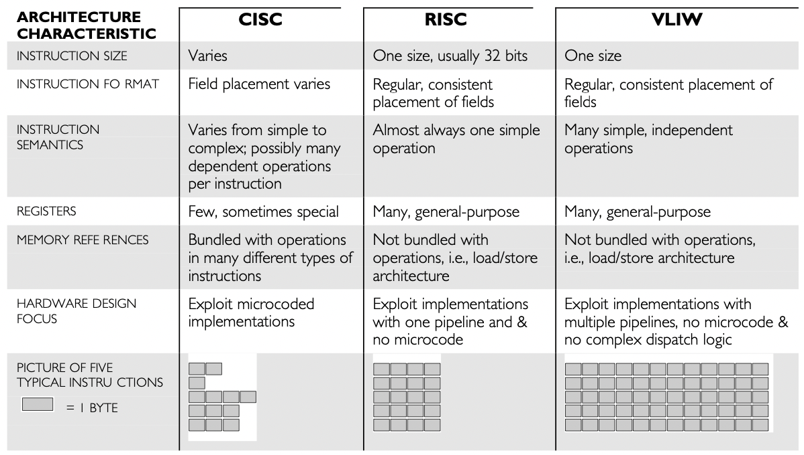
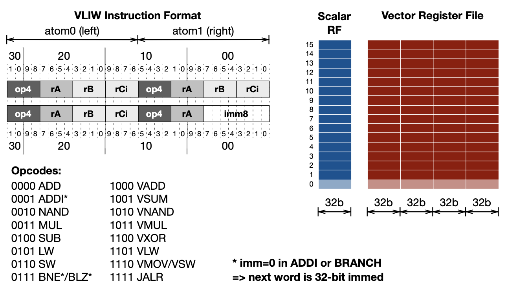

# RISC-32 ISA based CPU on FPGAs using Verilog
The three main objectives of this project are:
- To learn Verilog.
- Gain knowledge of the RISC-32 Instruction Set Architecture to facilitate the development of a softcore CPU on FPGAs for machine code execution.
- Comprehend parallelism concepts such as carrying out multiple instances of the same operation in parallel on various data sets.

## 1. RISC-32 Instruction Set
The RiSC-32 is a 32-bit VLIW (very long instruction word) design which encapsulates two atomic instructions into a single instruction word, so that the hardware can execute multiple things at once.
### 1.1 Very Long Instruction Word (VLIW)
#### 1.1.1 What is it?
Very Long Instruction Word (VLIW) architecture employs instructions that encode multiple operations within a single word.

Each instruction in a VLIW architecture typically consists of fixed-size fields, with each field dedicated to a specific operation or functional unit.

The VLIW instruction format allows for parallel execution of operations, enabling high performance in superscalar processors.

#### 1.1.2 Why use it? Pros & Cons
The key to higher performance in microprocessors for a broad range of applications is the ability to exploit fine-grain, instruction-level parallelism. Some methods for exploiting fine-grain parallelism include:
+ Pipelining
+ Multipleprocessors
+ Superscalarimplementation
+ Specifying multiple independent operations per instruction

Advantages :
+ Reduces hardware complexity.
+ Reduces power consumption because of reduction of hardware complexity.
+ Since compiler takes care of data dependency check, decoding, instruction issues, it becomes a lot simpler.
+ Increases potential clock rate.
Functional units are positioned corresponding to the instruction pocket by compiler.

Disadvantages :
+ Complex compilers are required which are hard to design.
Increased program code size.
+ Larger memory bandwidth and register-file bandwidth.
+ Unscheduled events, for example a cache miss could lead to a stall which will stall the entire processor.
+ In case of un-filled opcodes in a VLIW, there is waste of memory space and instruction bandwidth.

#### 1.1.3 Architecture comparison: CISC, RISC, and VLIW
The differences between RISC, CISC, and VLIW are in the formats and semantics of the instructions:

The number of CISC instructions varies, they frequently define an order of operations, and they may call for serial (slow) decoding techniques. A common feature of CISCs is their small number of registers, some of which may be special-purpose registers with limited uses. Usually, memory references are used in conjunction with other actions (add memory to register, for example). The purpose of CISC instruction sets is to leverage microcode.

RISC instructions are straightforward (fast) to decode, describe simple actions, and have a fixed size. There are a lot of general-purpose registers in RISC architectures. Only basic load-register-from-memory and store-register-to-memory operations allow instructions to access main memory. RISC instruction sets are made to make pipelining easier and do not require microcode.

VLIW instructions are lengthier than RISC instructions in order to indicate numerous independent simple operations. You can think of a VLIW instruction as multiple RISC instructions combined into one. Most characteristics of VLIW designs are RISC-like.

### 1.2 RISC-32 VLIW ISA
#### 1.2.1 VLIW Instruction Format
Both the data and the instructions have a length of 32 bits. Every 32-bit instruction is split into two atoms. An atom can operate on one of the two register files—the 16-entry vector register file on the right or the 16-entry scalar register file on the right—based on its opcode. 

Furthermore, an atom may function on both register files in specific situations. Each of the 16 registers in the scalar register file has a width of 32 bits. There are 16 registers in the vector register file as well, however they are all 128 bits wide, or one vector made up of four 32-bit words.

#### 1.2.2 Opcodes
Opcodes, which are 4-bit values, have sixteen various operations that they can encode. Furthermore, the meaning of some opcodes varies based on whether they appear on the right side (atom 1, the low-order bits) or the left side (atom 0, the high-order bits) of the instruction. Each of these is displayed separately in the above diagram. A read or write to the vector register file is indicated by the use of a "vX" register identifier in each case, while a read or write to the scalar register file is indicated by the use of a "rX" register identifier.